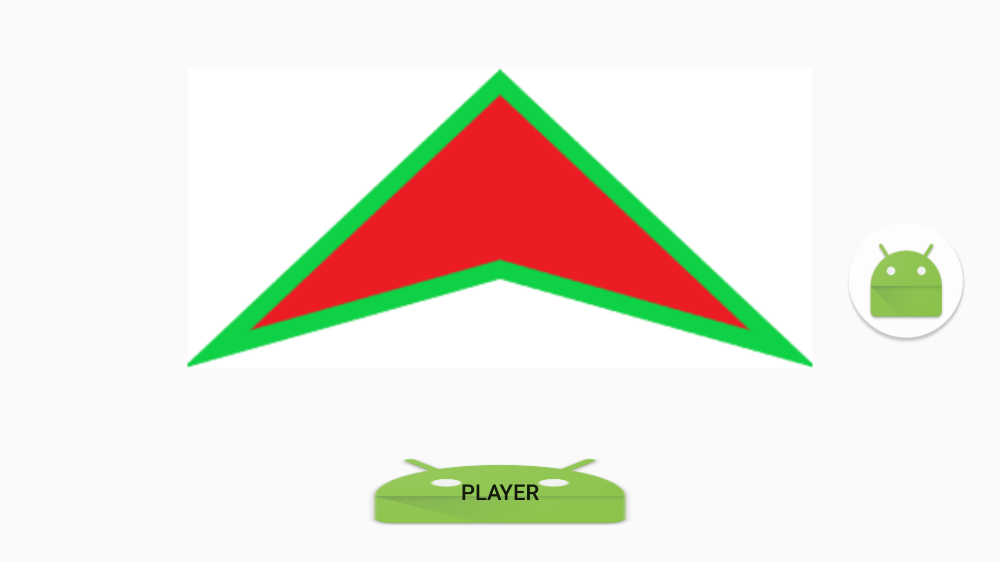
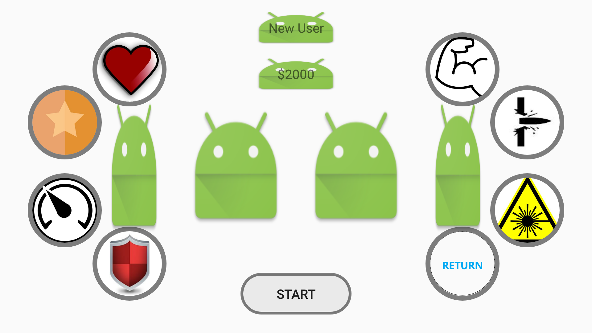
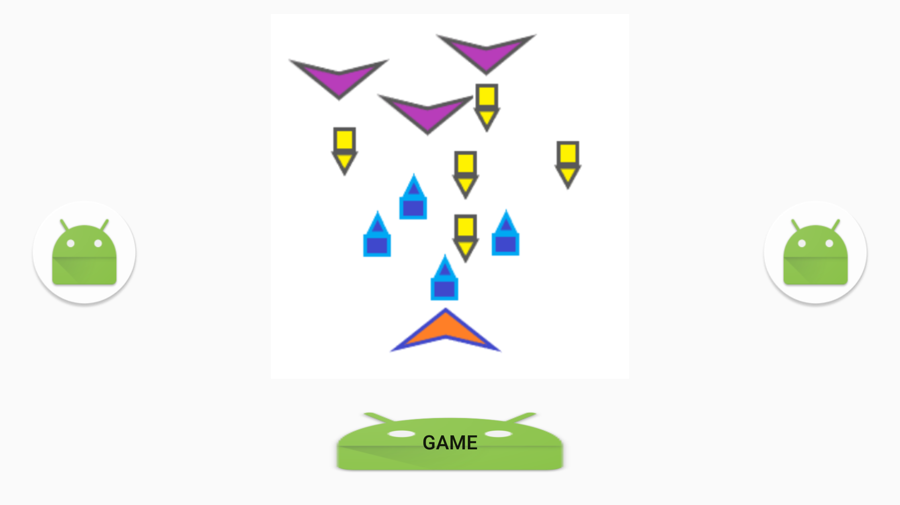
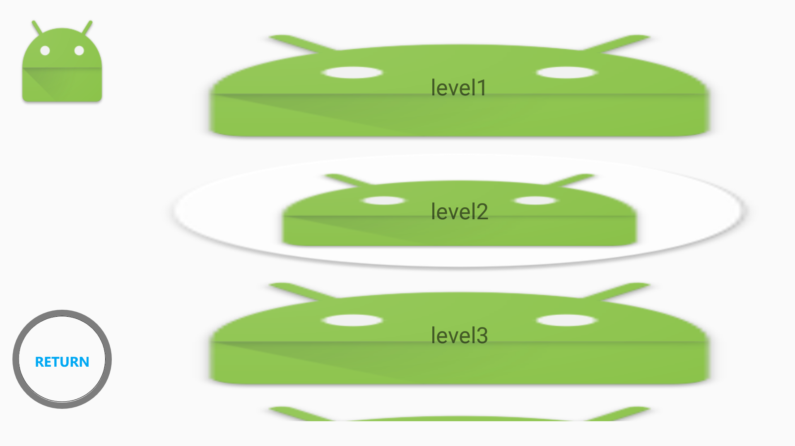
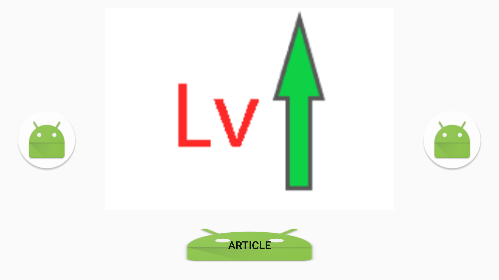
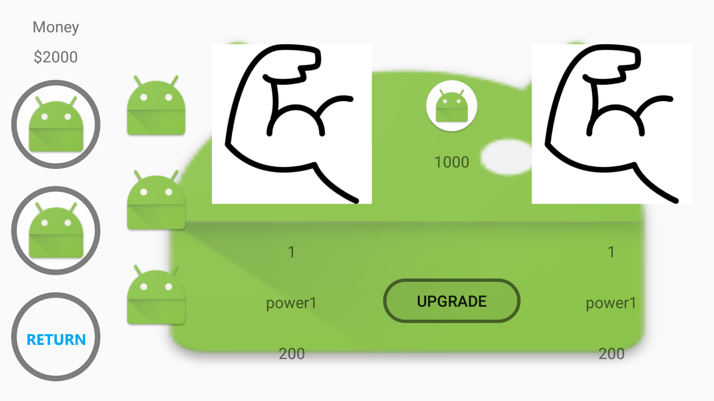
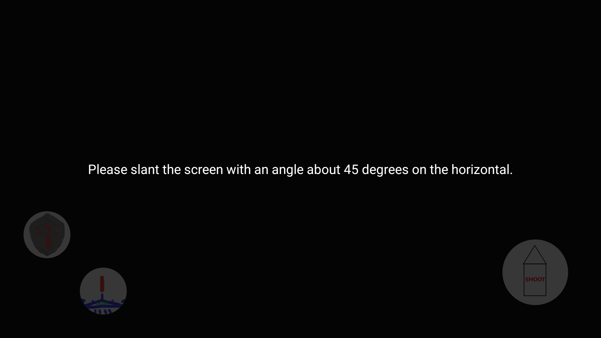
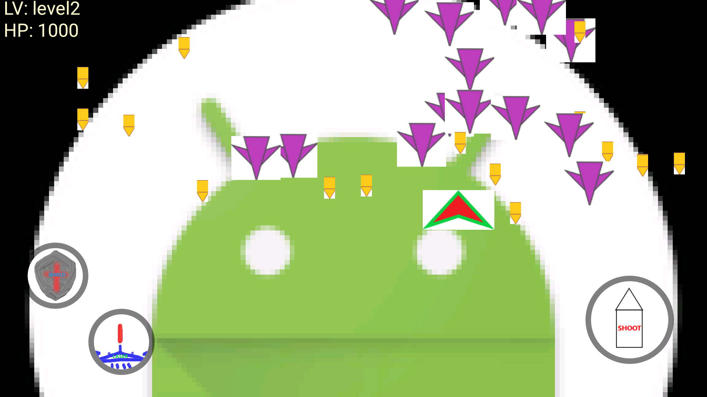
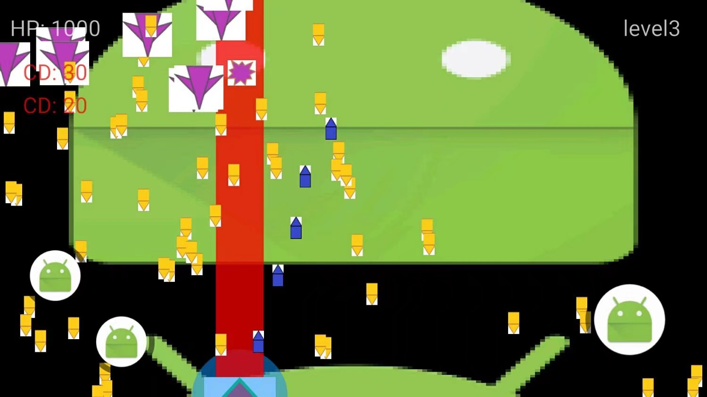
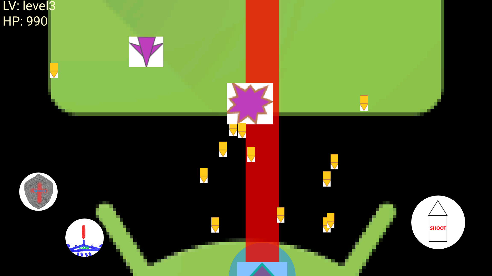

##一、 前言

这个项目是我在17年大三下期实习期间进行的，主要是想通过这个项目学习SurfaceView的绘制、SensorMannager的使用、非关系型数据库Snappy的使用、Dao设计，以及并发编程。

后面实习期结束时便返校开始进行秋招，这个项目就暂停了。

图片由灵魂画师——Mr.Zeng创作。

---
##二、 展示

###1. 菜单页——玩家

你没看错，这就是我设计的玩家的飞船，模仿美国B2轰炸机。

** **
###2. 玩家页

左边是生命值、防御值、移动速度、护盾，右边是攻击力、子弹射速、激光炮，中间是玩家名字和金币。

** **
###3. 菜单页-游戏

这里点进去就是选关卡了。

** **
###4. 游戏页

选关卡开始游戏。

** **
###5. 菜单页-商店

可以给你的战舰和子弹属性升级。

** **
###6. 商店页

最左边两个按钮分别是战舰和子弹，右边的列表对应属性和升级的物品。

** **
###7. 商店页-购买

我升级一个攻击力。

** **
###8. 游戏-准备

此时完成一些准备工作，并且提示玩家将手机倾斜45度，没错，这是一款重力感应游戏。

** **
###9. 游戏-敌机

一开始敌人就跟疯了一样一窝蜂冲过来围攻我。

** **
###10. 游戏-歼灭

还好消灭了大部分敌人，游戏设定普通敌机会一直跑到屏幕下方直到消失，而boss到靠近下方后又往上飞，一直来回。由于子弹射击时不好截图，就用以前的截图了。

** **
###11. 游戏-技能

打不赢了可以用技能，盾牌是护盾，一定时间加防御值，然后朝着敌机撞，虽然发生碰撞双方都会扣血，但是护盾加的防御还是挺高的，激光炮可以强力攻击打爆敌人的子弹并且穿透一切物体给敌机造成巨大伤害。

** **
###12. 游戏-boss

boss截图也不好截，直接用资源图。

** **
###13. 游戏-胜利

boss血非常厚，防御也很变态，爆炸效果还行。

---
##三、 心得

- 整个游戏可以说是又丑又失败，所以极其不建议读者安装试玩。
- 对于知识点的学习实践作用很大，尤其是对SurfaceView这种游戏专用视图的了解。
- 起先我是通过迭代runnable来绘制的UI，导致画面卡顿严重，后来同学发了个其他开发者的飞机大战demo——[StormPlane](https://github.com/HurTeng/StormPlane) 给我学习，顿悟后替换为SurfaceView，才完成了界面绘制。
- 目前大四下实习中，忙于学习前端开发，后面也不确定有没有时间和精力继续做这个项目了，要做还得大整改，项目重构，所以决定先把这个项目结了，告一段落，以后有缘再来更新。